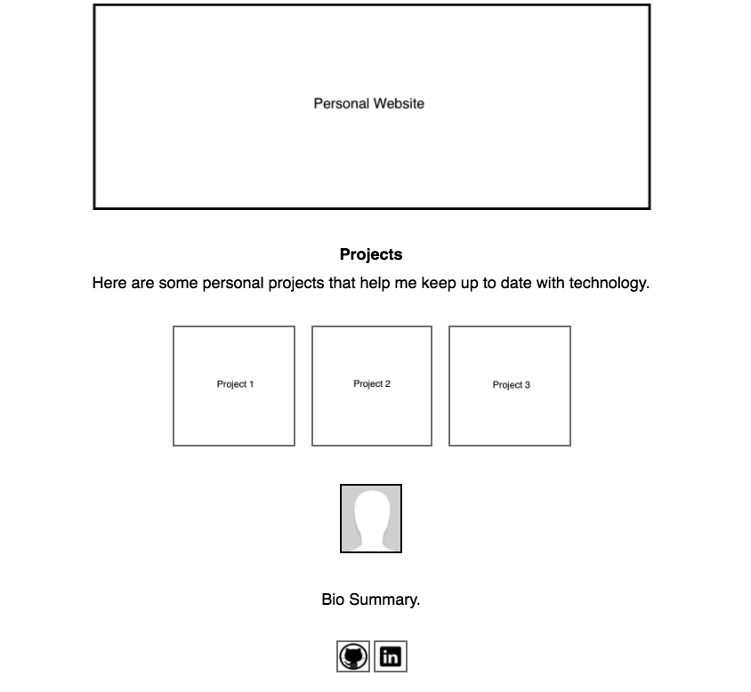

# personal-website
A template for a simple personal website which is easy to customize.



## prerequisites
Install docker

## setup
Steps to customize personal-website's images and text.

1. create Dockerfile in a local working directory (see below)
2. create an images folder and add updated versions of the files in the images folder
3. create a local copy of app.js and replace text
4. follow `build and run` instructions below to start the website


Dockerfile:
```
FROM jimareed/personal-website

WORKDIR /usr/share/nginx/html
COPY app.js /usr/share/nginx/html
ADD images/* /usr/share/nginx/html/images/
```

## build and run
```
docker build . -t website-image
docker run -p 80:80 -d --name website website-image
```

## cleanup
```
docker stop website
docker rm website
```
